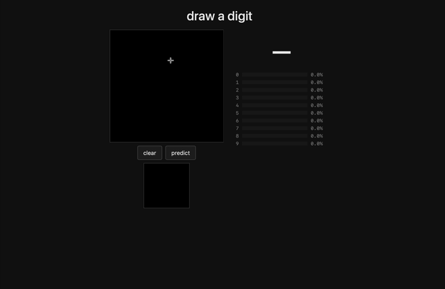
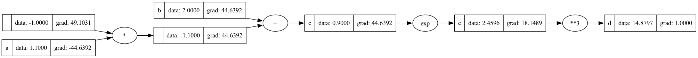

# NN-from-scratch

A small neural network library built from scratch using NumPy (no PyTorch/TensorFlow), trained to **97.5% accuracy on MNIST**. 

Includes an autograd engine (`minigrad.py`) with gradients that numerically match PyTorch on autograd tests.

Demo hosted at https://whatdigit.vercel.app, where you can draw a digit and see the model's predictions.


[](https://whatdigit.vercel.app)

## Files

- **Autograd engine** (`minigrad/engine.py`) — reverse-mode autodiff on a `Tensor` type with broadcasting, matmul, and higher-level ops including softmax and cross-entropy.
- **MLP module** (`minigrad/nn.py`) — `Layer` / `MLP` abstractions built on `Tensor`.
- **MNIST example** (`examples/mnist/`) — data loader (`data.py`), augmentation (`augment.py`), training loop (`train.py`), and the driver notebook (`train_mnist.ipynb`) that ties them together end-to-end.
- **Browser demo** (`web/`) — trained weights exported to a binary blob and run client-side in JS.
- **Tests** (`tests/test_minigrad.py`) — gradients checked against PyTorch.
- `examples/mnist/models/mnist_mlp_97_5.npz` — trained weights for the best model so far (**97.5% test accuracy**). Load with `np.load`.

## How the autograd works

Every operation on a `Tensor` builds a node in a computation graph, recording its inputs and a local backward function. Calling `.backward()` on the output does a topological sort of the graph and walks it in reverse, applying the chain rule at each node.



*(Rendered from an earlier scalar prototype of the engine; the graph today has the same shape but with `Tensor` objects.)*

## Results

Iterating on the MNIST classifier:

| Change                          | Test accuracy |
| ------------------------------- | ------------- |
| Baseline MLP                    | ~93%          |
| + softmax cross-entropy loss    | ~94%          |
| + higher learning rate + decay  | ~97%          |
| + dropout + data augmentation   | **>97.5%**     |

Final model is a 784 -> 100 -> 10 MLP, with tanh activations, dropout_p = 0.2.

## Run it

Train:

Requires the MNIST dataset in `examples/mnist/data/`, in the original IDX format from e.g. [Kaggle mirror](https://www.kaggle.com/datasets/hojjatk/mnist-dataset):

```
examples/mnist/data/
├── train-images.idx3-ubyte
├── train-labels.idx1-ubyte
├── t10k-images.idx3-ubyte
└── t10k-labels.idx1-ubyte
```

Then:

```bash
python -m venv .venv && source .venv/bin/activate
pip install -r requirements.txt
pip install -e .   # makes `minigrad` importable from the notebook and scripts
jupyter notebook examples/mnist/train_mnist.ipynb
```

(For running the tests, use `requirements-dev.txt` instead — adds `torch` and `pytest`.)

Serve the web demo:
```bash
cd web && python -m http.server 8000
# open http://localhost:8000
```

## Next steps (ideas)

- Try a CNN and compare to the 97.5%
- Optimise training: currently plain SGD with step decay, could add momentum, Nesterov, or Adam.
- L2 weight decay, early stopping, label smoothing
- Train on **Fashion MNIST**
- Better autograd: support more ops, broadcasting edge cases, `no_grad` context.
- Training ergonomics: extract training loop into `train.py` with better CLI flags and info
- Generalisation: a proper `Module` base class, an `Optimizer` interface, a `DataLoader`-style batching abstraction.
- Confusion matrix and per-class accuracy
- Multiple digits?

## Resources

Started from Andrej Karpathy's [micrograd walkthrough](https://www.youtube.com/watch?v=VMj-3S1tku0), then extended to tensors, an MLP training loop, augmentation, and the browser demo.
